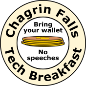

# Chagrin Falls Tech Breakfast
## Bring your wallet | No speeches

The Chagrin Falls Tech Breakfast is an informal group that meets for breakfast monthly. We're open to any tech discipline and any level of experience, from complete newcomers to experienced veterans.

We intentionally have no set agendas aside from getting to know the local tech community better and, of course, eating breakfast. Job seekers and recruiters are welcome.

Thanks to everyone who has participated in our gatherings so far! With so many of us working remotely or for smaller companies, it's great to have a chance to connect outside of the workday.

### How to find us

We generally meet at a restaurant around Chagrin Falls before work on a Friday morning. If you plan to join us, please [RSVP on our meetup.com group](https://www.meetup.com/Chagrin-Falls-Tech-Breakfast/) in advance so we know how large of a table to request.

Membership in this group is free, just please remember to bring your wallet since we all pay for our meals individually. When you arrive at the restaurant please ask at the host stand for the "Tech breakfast," and they'll point you in our direction.

To participate, please [join our meetup.com group](https://www.meetup.com/Chagrin-Falls-Tech-Breakfast/). We also have a [Slack](https://join.slack.com/t/cf-tech/shared_invite/zt-7wpr6mzk-JFyRQoJQzMlKP6r71R9VOw) for continuing conversations between gatherings.

If you’re looking for job opportunities in the area, please don’t be shy! If you have business cards, bring them. If you want to exchange LinkedIn information during breakfast, do it. We also have an #opportunities channel in Slack for job seeking and job postings.

### Questions?

If you have any questions, please feel free to send a message via the [meetup.com group](https://www.meetup.com/Chagrin-Falls-Tech-Breakfast/) or ask in [Slack](https://join.slack.com/t/cf-tech/shared_invite/zt-7wpr6mzk-JFyRQoJQzMlKP6r71R9VOw). The Meetup group organizers are Brian Warner and Adam Anthony, and Slack is administered by Scott Rolf.

We hope you can join us!

